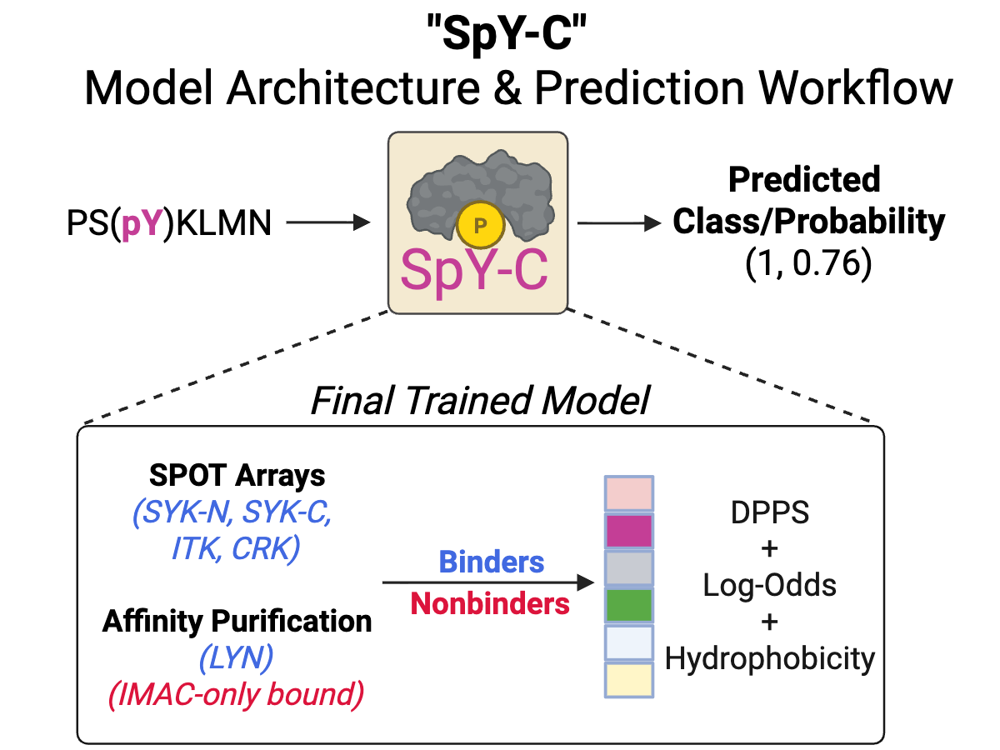
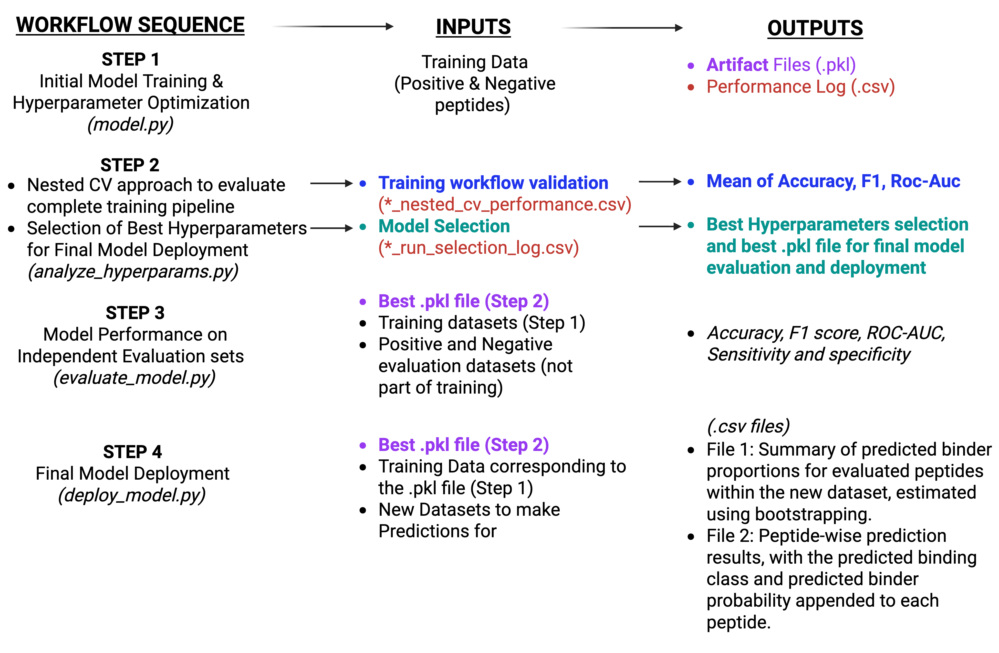

# SpY-C
SH2-pY global classification SVM model
<p align="center">
  
</p>

---
# Requirements

## Python Version
- Python **≥ 3.9**

## Dependencies

Install all required packages using:

```bash
pip install -r requirements.txt
```
---
### Overview of SpY-C pipeline

 


### Step 1 - To build an SVM-based SH2-pY classifier using curated binder and non-binder peptide datasets.
```bash 
python build_model.py \
  --binders-file prototyping/Input_files/Final_positive_training.txt \
  --nonbinders-file prototyping/Input_files/Final_negative_training.txt \
  --label FinalSet
```
1. Inputs
- Positive training set 
- Negative training set

2. Outputs
- test_nested_cv_performance.csv - this file contains fold-specific metrics (Accuracy, F1 score, ROC-AUC, selected C and γ values, and the inner cross-validation ROC-AUC across the 10 outer-fold evaluations).
- _candidate_selection_log.csv - contains model-selection performance of each candidate SVM hyperparameter combination (C and gamma) evaluated across 10 repeated 5-fold cross-validation runs, including the mean ROC-AUC, variability across runs, and number of runs. This log is used to identify the hyperparameter combination (C and γ) selected for the final deployment model.
- Trained model artifact (.pkl) - For the selected optimal SVM hyperparameters (C and γ), the final model is trained using the entire training dataset and saved as a .pkl file for subsequent evaluation on independent datasets and for deployment on new datasets for predictions.

### Step 2 - To evaluate model performance.
- Useful to compare across candidate training models to pick the best training dataset
```bash
python evaluate_model.py \
  --best_pkl prototyping/step1_outputs/FinalSet_FinalDeploy_C0.5_g1.0_selAUC0.9304.pkl \
  --binder prototyping/Input_files/Final_positive_training.txt \
  --nonbinder prototyping/Input_files/Final_negative_training.txt \
  --test_pos prototyping/Input_files/comb_positive_evaluation.txt \
  --test_neg prototyping/Input_files/comb_negative_evaluation.txt \
  --label FinalSet \
  --output prototyping/step2_outputs/evaluation_results_FinalSet.csv
```
Outputs
- evaluation_results_.csv contains the performance metrics (Sensitivity, Specificity, Accuracy, F1-score, and ROC-AUC) obtained by evaluating the model trained on a candidate training dataset against the evaluation datasets.

### Step 3 - To run predictions using the selected trained model on new peptide datasets.
```bash

python deploy_model.py \
  --model prototyping/step1_outputs/FinalSet_FinalDeploy_C0.5_g1.0_selAUC0.9304.pkl \
  --binders prototyping/Input_files/Final_positive_training.txt \
  --nonbinders prototyping/Input_files/Final_negative_training.txt \
  --datasets examples/set1.txt examples/set2.txt \
  --outdir prototyping/step3_outputs \
  --names set1 set2 \
  --summary_name set_summary \
  --use_labels false false
```

Outputs
- *_predictions.csv → peptide wise predicted class + probabilities (for every input dataset separately)
- Bootstrap based Summary statistics across each Dataset 

