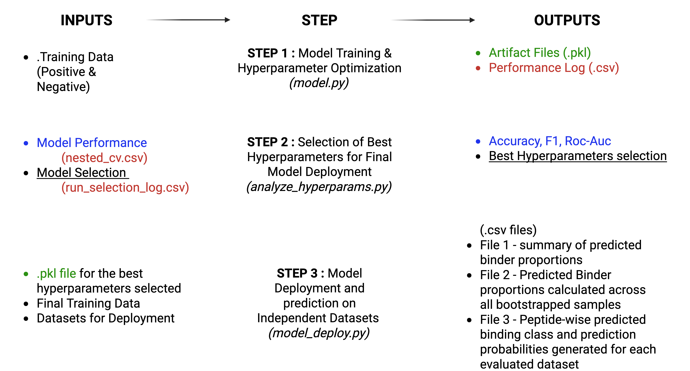

# SpY-C
SH2-pY global classification SVM model


# Requirements

## Python Version
- Python **≥ 3.9**

## Dependencies

Install all required packages using:

```bash
pip install -r requirements.txt
```
### To build an SVM-based SH2-pY classifier using curated binder and non-binder peptide datasets.
```bash 
python model.py
```
1. Inputs
- Positive training set (Final_positive_training.txt)
- Negative training set (Final_negative_training.txt)

2. Outputs
- Trained model artifacts (.pkl)
- test_nested_cv_performance.csv
- test_run_Selection_log.csv

### To identify best hyperparameters for Final model development.
```bash
python analyze_hyperparams.py \
  --perf test_nested_cv_performance.csv \
  --runlog test_run_Selection_log.csv 
```

Outputs
- summary csv files and png images to chose the best hyperparameters across runs
   
### To run predictions using the trained model on new peptide datasets.
```bash

python deploy_model.py \
  --model examples/test.pkl \
  --binders Final_positive_training.txt \
  --nonbinders Final_negative_training.txt \
  --datasets set1.txt set2.txt \
  --outdir results/ \
  --names set1 set2
```

Inside results/:

1. *_predictions.csv → peptide wise predicted class + probabilities
2. Bootstrap based Summary statistics across each Dataset 


 
